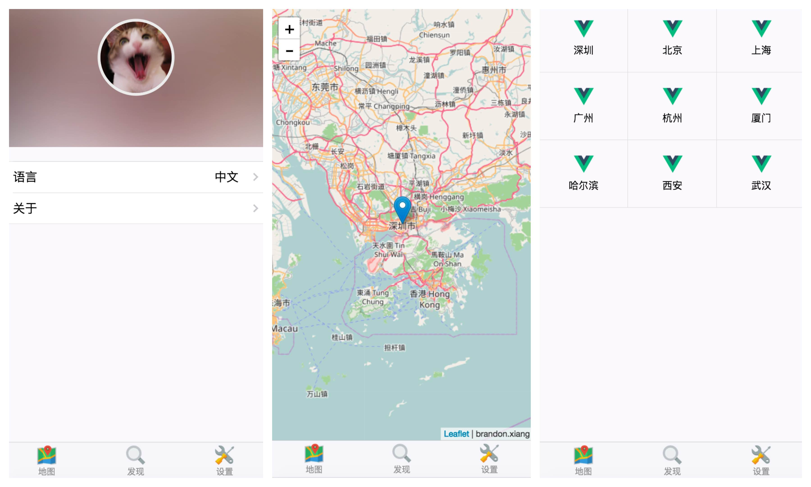

# vue-leaflet-mobile

A vue mobile webapp for leaflet.js which is produced by [vue](https://github.com/vuejs/vue), [vuex](https://github.com/vuejs/vuex), [vueleaflet](https://github.com/brandonxiang/vueleaflet), [vux](https://github.com/airyland/vux) and [vue-router](https://github.com/vuejs/vue-router). The project is built by [vux-cli](https://github.com/vuejs/vue-cli).

## Development

```
npm run dev
```

## build

```
npn run build
```

## Screen Shot



## DEMO

[DEMO](https://www.shanww.cc/app/)

[PC DEMO](https://brandonxiang.github.io/vue-leaflet-mobile/www/)


## Chinese Doc

[CN_DOC](README_CN.md)

## TODO

- [ ] font size depends on window size
- [ ] ajax for city data
- [ ] localstorage
- [ ] vue meta
- [x] vuex router sync

## LICENSE

[MIT](LICENSE)


## Build Setup

``` bash
# install dependencies
npm install

# serve with hot reload at localhost:8080
npm run dev

# build for production with minification
npm run build

# build for production and view the bundle analyzer report
npm run build --report
```

For detailed explanation on how things work, checkout the [guide](http://vuejs-templates.github.io/webpack/) and [docs for vue-loader](http://vuejs.github.io/vue-loader).
