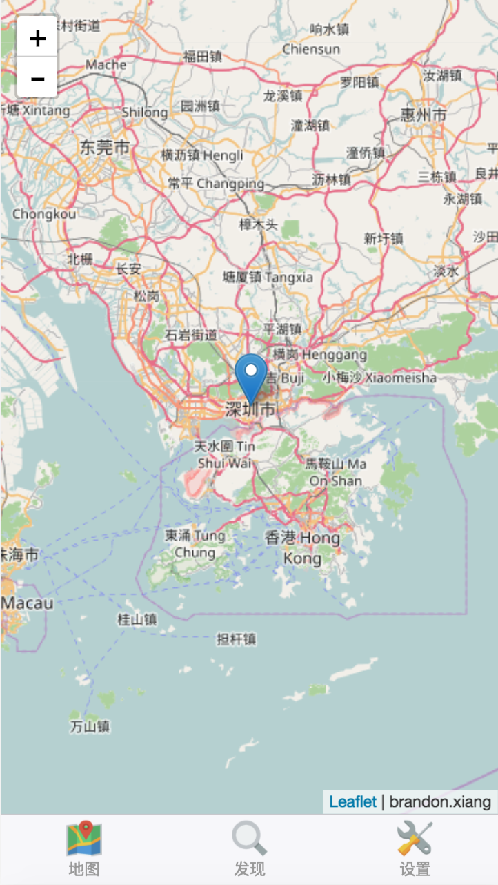
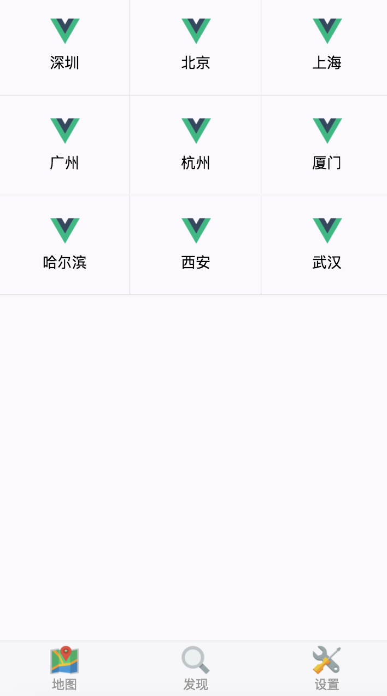
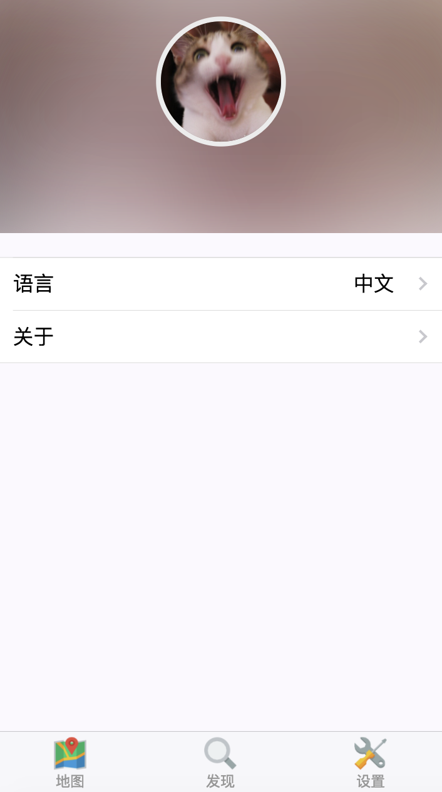

# vue-leaflet-mobile

A vue mobile webapp for leaflet.js which is produced by [vue](https://github.com/vuejs/vue), [vuex](https://github.com/vuejs/vuex), [vueleaflet](https://github.com/brandonxiang/vueleaflet), [vux](https://github.com/airyland/vux) and [vue-router](https://github.com/vuejs/vue-router). The project is built by [vux-cli](https://github.com/vuejs/vue-cli).

## Development

```
npm run dev
```

## build

```
npn run build
```

## Screen Shot





## DEMO

[PC DEMO](https://brandonxiang.github.io/vue-leaflet-mobile/dist/)


## LICENSE

[MIT](LICENSE)

[Wechat Offical Code](src/assets/qrcode.jpg)